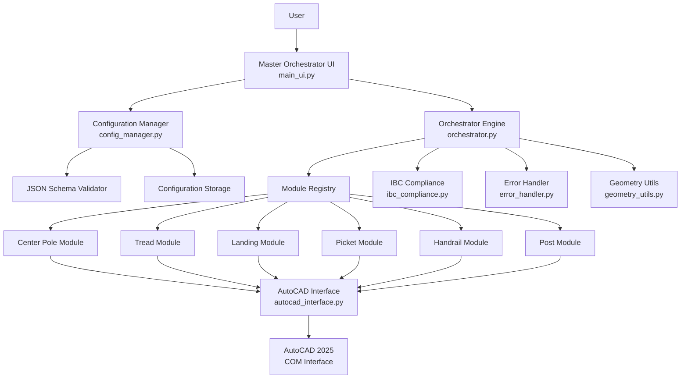
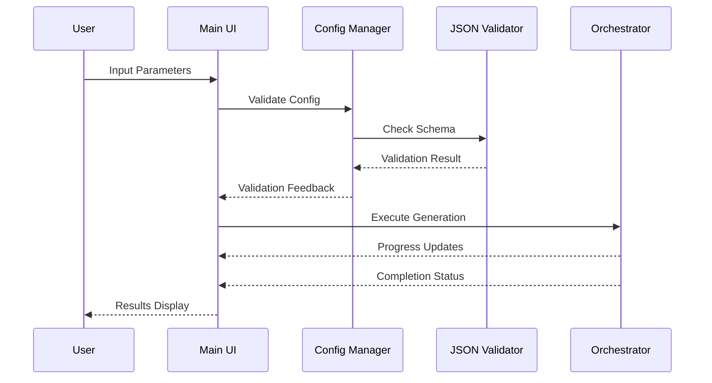
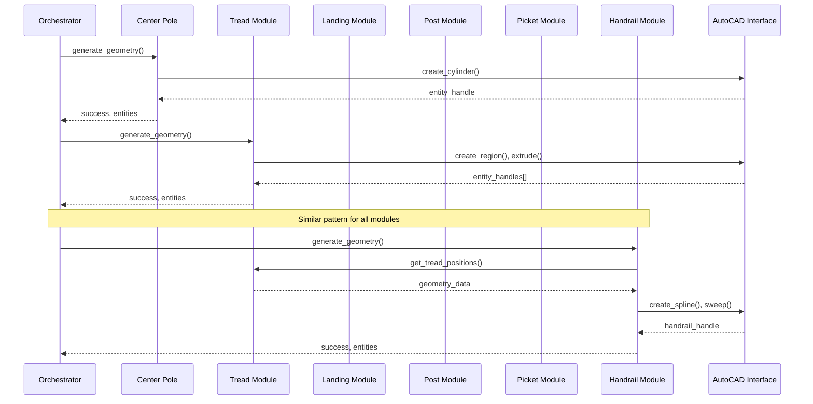
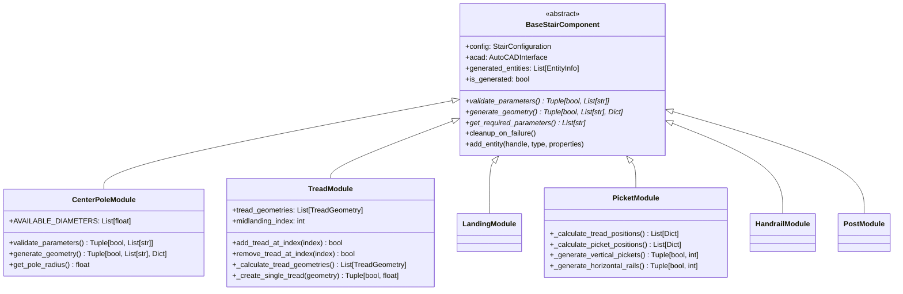
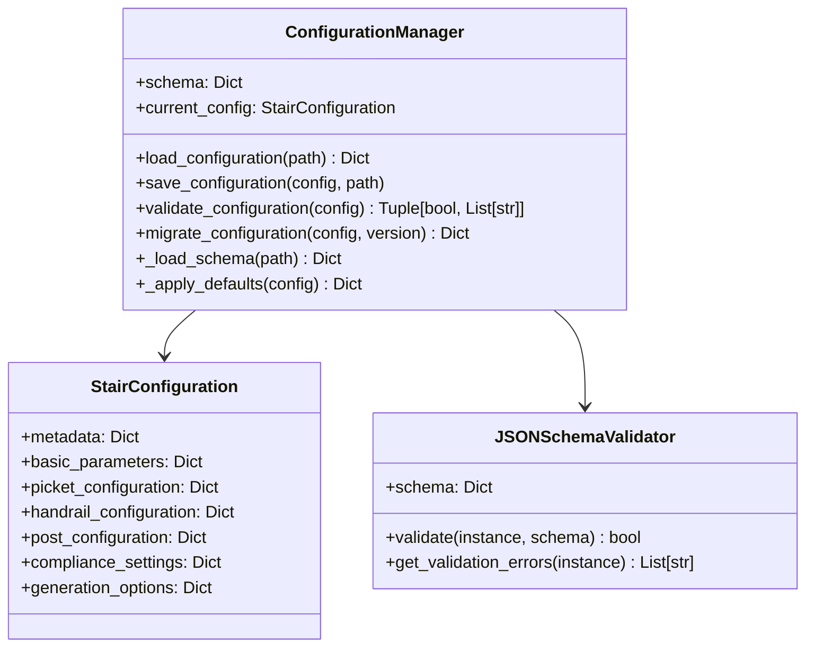
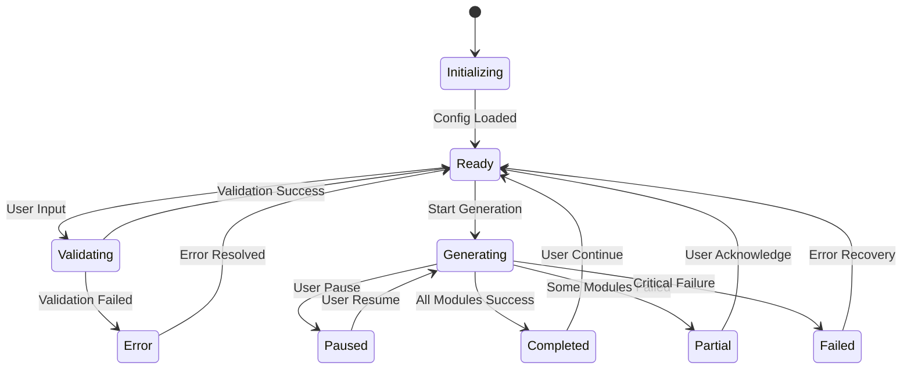

# Technical Architecture Specification
## Modular Spiral Stair Creator System

### Architecture Overview

The system follows a modular orchestrator pattern where a master UI coordinates individual component modules through a centralized configuration system. Each module operates independently and can fail without affecting other components.

#### High-Level System Architecture



#### Detailed Component Architecture

```
┌─────────────────────────────────────────────────────────────────┐
│                    Master Orchestrator UI                      │
│                      (main_ui.py)                             │
│  ┌─────────────┐ ┌─────────────┐ ┌─────────────┐              │
│  │Basic Params │ │Picket Config│ │Handrail Cfg │              │
│  │    Tab      │ │    Tab      │ │    Tab      │  ...         │
│  └─────────────┘ └─────────────┘ └─────────────┘              │
└─────────────────────┬───────────────────────────────────────────┘
                      │
┌─────────────────────▼───────────────────────────────────────────┐
│                Configuration Manager                           │
│                  (config_manager.py)                          │
│  ┌─────────────────────────┐ ┌─────────────────────────────┐   │
│  │    JSON Schema          │ │    Migration Engine         │   │
│  │    Validation           │ │    (v1.0→v1.1→v1.2)        │   │
│  └─────────────────────────┘ └─────────────────────────────┘   │
└─────────────────────┬───────────────────────────────────────────┘
                      │
┌─────────────────────▼───────────────────────────────────────────┐
│                 Orchestrator Engine                            │
│                 (orchestrator.py)                             │
│  ┌─────────────┐ ┌─────────────┐ ┌─────────────┐              │
│  │Module       │ │Progress     │ │Dependency   │              │
│  │Registry     │ │Tracker      │ │Manager      │              │
│  └─────────────┘ └─────────────┘ └─────────────┘              │
└─┬─────┬─────┬─────┬─────┬─────┬─────────────────────────────────┘
  │     │     │     │     │     │
  ▼     ▼     ▼     ▼     ▼     ▼
┌────┐┌────┐┌────┐┌────┐┌────┐┌────┐
│Pole││Tread││Land││Pick││Hand││Post│  Component Modules
│    ││     ││    ││et  ││rail││    │  (BaseStairComponent)
└────┘└────┘└────┘└────┘└────┘└────┘
  │     │     │     │     │     │
  └─────┴─────┴─────┴─────┴─────┘
                  │
        ┌─────────▼─────────┐
        │  AutoCAD Interface │
        │ (autocad_interface.py) │
        │  ┌─────────────────┐   │
        │  │Connection Pool  │   │
        │  │Retry Logic      │   │
        │  │Entity Cache     │   │
        │  └─────────────────┘   │
        └─────────┬─────────┘
                  │
        ┌─────────▼─────────┐
        │   AutoCAD 2025    │
        │   COM Interface   │
        │  ┌─────────────────┐   │
        │  │ModelSpace       │   │
        │  │Entity Manager   │   │
        │  │Drawing Context  │   │
        │  └─────────────────┘   │
        └───────────────────┘
```

#### Data Flow Diagrams

**Configuration Processing Flow:**


**Module Execution Sequence:**


#### Class Relationship Diagrams

**BaseStairComponent Inheritance:**


**Configuration System:**


**Interface Contracts:**

**IGeometryProvider Interface:**
```python
from abc import ABC, abstractmethod
from typing import List, Dict, Tuple

class IGeometryProvider(ABC):
    """Interface for modules that provide geometry data to other modules"""
    
    @abstractmethod
    def get_geometry_data(self) -> Dict[str, Any]:
        """Return geometry data for use by dependent modules"""
        pass
        
    @abstractmethod
    def get_reference_points(self) -> List[Tuple[float, float, float]]:
        """Return key reference points for positioning dependent components"""
        pass
        
    @abstractmethod
    def get_bounding_geometry(self) -> Dict[str, float]:
        """Return bounding box and key dimensions"""
        pass
```

**IGeometryConsumer Interface:**
```python
from abc import ABC, abstractmethod
from typing import Dict, Any

class IGeometryConsumer(ABC):
    """Interface for modules that depend on geometry from other modules"""
    
    @abstractmethod
    def set_dependency_data(self, provider_name: str, geometry_data: Dict[str, Any]) -> bool:
        """Receive geometry data from a provider module"""
        pass
        
    @abstractmethod
    def get_dependencies(self) -> List[str]:
        """Return list of required provider module names"""
        pass
        
    @abstractmethod
    def validate_dependencies(self) -> Tuple[bool, List[str]]:
        """Validate that all required dependencies are satisfied"""
        pass
```

**Enhanced Module Registry:**
```python
class ModuleRegistry:
    """Registry managing module dependencies and execution order"""
    
    def __init__(self):
        self.modules: Dict[str, Type[BaseStairComponent]] = {}
        self.providers: Dict[str, IGeometryProvider] = {}
        self.consumers: Dict[str, IGeometryConsumer] = {}
        self.dependency_graph: Dict[str, List[str]] = {}
        
    def register_module(self, name: str, module_class: Type[BaseStairComponent]) -> bool:
        """Register a module with dependency tracking"""
        
    def calculate_execution_order(self) -> List[str]:
        """Calculate topological sort of modules based on dependencies"""
        
    def validate_dependency_graph(self) -> Tuple[bool, List[str]]:
        """Check for circular dependencies and missing providers"""
```

### Core Architecture Components

#### 1. Master Orchestrator UI (`src/ui/main_ui.py`)

**Purpose**: Primary user interface replacing VBA UserForm1.frm with enhanced capabilities.

**Design Pattern**: Model-View-Controller (MVC)
- **Model**: Configuration data and validation state
- **View**: tkinter UI components with ttk styling  
- **Controller**: Event handlers and orchestrator communication

**Key Components**:
```python
class MainUI:
    def __init__(self):
        self.root = tk.Tk()
        self.config_manager = ConfigManager()
        self.orchestrator = Orchestrator()
        self.setup_ui()
        
    def setup_ui(self):
        # Create tabbed interface
        self.notebook = ttk.Notebook(self.root)
        self.create_basic_params_tab()
        self.create_picket_config_tab()  
        self.create_handrail_config_tab()
        self.create_post_config_tab()
        self.create_advanced_options_tab()
        
    def generate_stair(self):
        # Validate configuration
        # Execute orchestrator
        # Display results
```

**UI Layout Structure**:
```
┌─────────────────────────────────────────────────────────────────┐
│ File  Edit  View  Tools  Help                          [X]     │
├─────────────────────────────────────────────────────────────────┤
│ ┌─ Basic ─┐┌─ Pickets ─┐┌─ Handrail ─┐┌─ Posts ─┐┌─ Advanced ─┐│
│ │         ││           ││            ││         ││            ││
│ │ Center  ││ Spacing:  ││ Height:    ││ Spacing:││ IBC        ││
│ │ Pole Ø  ││ [6.0___]  ││ [36.0___]  ││ [4____] ││ Override   ││
│ │ [5.0__] ││           ││            ││         ││ [ ]        ││
│ │         ││ Style:    ││ Diameter:  ││ Type:   ││            ││
│ │ Height  ││ [Vertical]││ [1.5____]  ││ [Welded]││ Regional   ││
│ │ [120.0] ││           ││            ││         ││ Code:      ││
│ │         ││ Material: ││ Material:  ││ Height: ││ [IBC_2021] ││
│ │ Outside ││ [Aluminum]││ [Aluminum] ││ [2.0__] ││            ││
│ │ Ø [72.0]││           ││            ││         ││            ││
│ │         ││ Height    ││ Continuous:││         ││            ││
│ │ Rotation││ Ratio:    ││ [✓]        ││         ││            ││
│ │ [360°]  ││ [0.8___]  ││            ││         ││            ││
│ │         ││           ││            ││         ││            ││
│ │ [✓] CW  ││ [✓] Enable││ [✓] Enable ││[✓] Enable││            ││
│ └─────────┘└───────────┘└────────────┘└─────────┘└────────────┘│
├─────────────────────────────────────────────────────────────────┤
│ Configuration: [Load] [Save] [Reset]  Preview: [Generate][View] │
├─────────────────────────────────────────────────────────────────┤
│ Progress: ████████░░ 80% - Generating handrail...              │
├─────────────────────────────────────────────────────────────────┤
│ Status: Ready                                       [Generate]  │
└─────────────────────────────────────────────────────────────────┘
```

#### 2. Configuration Manager (`src/core/config_manager.py`)

**Purpose**: Centralized configuration handling with validation and persistence.

**Core Class Design**:
```python
from jsonschema import validate
from dataclasses import dataclass
from typing import Dict, Any, Optional

@dataclass
class StairConfiguration:
    basic_parameters: Dict[str, Any]
    picket_configuration: Dict[str, Any]
    handrail_configuration: Dict[str, Any]
    post_configuration: Dict[str, Any]
    compliance_settings: Dict[str, Any]
    metadata: Dict[str, Any]

class ConfigManager:
    def __init__(self, schema_path: str = "schemas/stair_config.json"):
        self.schema = self._load_schema(schema_path)
        self.current_config: Optional[StairConfiguration] = None
        
    def validate_config(self, config: Dict[str, Any]) -> Tuple[bool, List[str]]:
        """Validate configuration against JSON schema"""
        try:
            validate(instance=config, schema=self.schema)
            return True, []
        except ValidationError as e:
            return False, [str(e)]
            
    def load_config(self, file_path: str) -> bool:
        """Load configuration from JSON file"""
        
    def save_config(self, file_path: str) -> bool:
        """Save current configuration to JSON file"""
        
    def get_default_config(self) -> StairConfiguration:
        """Return default configuration with reasonable values"""
```

**Configuration Schema Structure**:
```json
{
  "$schema": "http://json-schema.org/draft-07/schema#",
  "type": "object",
  "properties": {
    "basic_parameters": {
      "type": "object",
      "properties": {
        "center_pole_diameter": {"type": "number", "minimum": 3.0, "maximum": 12.75},
        "overall_height": {"type": "number", "minimum": 24.0, "maximum": 240.0},
        "outside_diameter": {"type": "number", "minimum": 36.0, "maximum": 120.0},
        "total_rotation": {"type": "number", "minimum": 180.0, "maximum": 720.0},
        "is_clockwise": {"type": "boolean"}
      },
      "required": ["center_pole_diameter", "overall_height", "outside_diameter", "total_rotation"]
    },
    "picket_configuration": {
      "type": "object",
      "properties": {
        "enabled": {"type": "boolean"},
        "spacing_inches": {"type": "number", "minimum": 2.0, "maximum": 4.0},
        "height_ratio": {"type": "number", "minimum": 0.5, "maximum": 1.0},
        "style": {"type": "string", "enum": ["vertical", "horizontal", "crossed"]},
        "material": {"type": "string", "enum": ["aluminum", "steel", "wood"]}
      }
    }
  }
}
```

#### 3. Orchestrator Engine (`src/core/orchestrator.py`)

**Purpose**: Coordinates module execution with error handling and progress tracking.

**Core Design**:
```python
from enum import Enum
from typing import List, Dict, Callable, Optional
import logging

class ModuleStatus(Enum):
    PENDING = "pending"
    IN_PROGRESS = "in_progress" 
    COMPLETED = "completed"
    FAILED = "failed"
    SKIPPED = "skipped"

class ExecutionResult:
    def __init__(self, success: bool, messages: List[str], entities: Dict[str, Any]):
        self.success = success
        self.messages = messages
        self.entities = entities
        self.timestamp = datetime.now()

class Orchestrator:
    def __init__(self, autocad_interface: AutoCADInterface):
        self.acad = autocad_interface
        self.modules = {}
        self.execution_order = [
            "center_pole", "treads", "landings", 
            "posts", "pickets", "hanrails"
        ]
        self.progress_callback: Optional[Callable] = None
        
    def register_module(self, name: str, module_class):
        """Register a component module"""
        self.modules[name] = module_class
        
    def execute_stair_generation(self, config: StairConfiguration) -> Dict[str, ExecutionResult]:
        """Execute all modules in sequence with error isolation"""
        results = {}
        
        for i, module_name in enumerate(self.execution_order):
            if module_name not in self.modules:
                continue
                
            # Update progress
            progress = (i / len(self.execution_order)) * 100
            if self.progress_callback:
                self.progress_callback(progress, f"Generating {module_name}...")
                
            try:
                module = self.modules[module_name](config, self.acad)
                
                # Validate parameters
                is_valid, errors = module.validate_parameters()
                if not is_valid:
                    results[module_name] = ExecutionResult(False, errors, {})
                    continue
                    
                # Generate geometry
                success, messages, entities = module.generate_geometry()
                results[module_name] = ExecutionResult(success, messages, entities)
                
            except Exception as e:
                logging.error(f"Module {module_name} failed: {str(e)}")
                results[module_name] = ExecutionResult(False, [str(e)], {})
                # Continue with other modules
                
        return results
```

#### 4. Base Module Pattern (`src/modules/base_module.py`)

**Purpose**: Standardized interface for all component modules.

**Abstract Base Class**:
```python
from abc import ABC, abstractmethod
from typing import Tuple, List, Dict, Any

class BaseStairComponent(ABC):
    def __init__(self, config: StairConfiguration, autocad_interface: AutoCADInterface):
        self.config = config
        self.acad = autocad_interface
        self.logger = logging.getLogger(self.__class__.__name__)
        
    @abstractmethod
    def validate_parameters(self) -> Tuple[bool, List[str]]:
        """
        Validate component-specific parameters
        Returns: (is_valid, error_messages)
        """
        pass
        
    @abstractmethod
    def generate_geometry(self) -> Tuple[bool, List[str], Dict[str, Any]]:
        """
        Generate component geometry in AutoCAD
        Returns: (success, messages, entity_info)
        """
        pass
        
    @abstractmethod
    def get_required_parameters(self) -> List[str]:
        """
        Return list of required configuration parameters
        """
        pass
        
    def cleanup_on_failure(self):
        """Optional cleanup method called if generation fails"""
        pass
        
    def get_generated_entities(self) -> List[str]:
        """Return list of AutoCAD entity handles created by this module"""
        return getattr(self, '_entity_handles', [])
```

#### 5. AutoCAD Interface Wrapper (`src/core/autocad_interface.py`)

**Purpose**: Robust AutoCAD COM integration with error handling and optimization.

**Design Pattern**: Facade pattern to simplify AutoCAD COM complexity

**Core Implementation**:
```python
import win32com.client
from typing import Optional, List, Dict, Any
import time

class AutoCADInterface:
    def __init__(self):
        self.app: Optional[object] = None
        self.doc: Optional[object] = None
        self.model_space: Optional[object] = None
        self.connection_retries = 3
        self.batch_operations = []
        
    def connect(self) -> bool:
        """Establish connection to AutoCAD with retry logic"""
        for attempt in range(self.connection_retries):
            try:
                self.app = win32com.client.GetActiveObject("AutoCAD.Application")
                self.doc = self.app.ActiveDocument
                self.model_space = self.doc.ModelSpace
                
                # Set units to decimal inches
                self.doc.SetVariable("LUNITS", 2)
                self.doc.SetVariable("INSUNITS", 1)
                
                return True
            except Exception as e:
                if attempt < self.connection_retries - 1:
                    time.sleep(1)
                    continue
                self.logger.error(f"Failed to connect to AutoCAD: {str(e)}")
                return False
                
    def create_cylinder(self, center: List[float], radius: float, height: float) -> Optional[str]:
        """Create cylinder and return entity handle"""
        try:
            cylinder = self.model_space.AddCylinder(center, radius, height)
            return cylinder.Handle
        except Exception as e:
            self.logger.error(f"Failed to create cylinder: {str(e)}")
            return None
            
    def create_line(self, start_point: List[float], end_point: List[float]) -> Optional[str]:
        """Create line and return entity handle"""
        try:
            line = self.model_space.AddLine(start_point, end_point)
            return line.Handle
        except Exception as e:
            self.logger.error(f"Failed to create line: {str(e)}")
            return None
            
    def create_arc(self, center: List[float], radius: float, start_angle: float, end_angle: float) -> Optional[str]:
        """Create arc and return entity handle"""
        try:
            arc = self.model_space.AddArc(center, radius, start_angle, end_angle)
            return arc.Handle
        except Exception as e:
            self.logger.error(f"Failed to create arc: {str(e)}")
            return None
            
    def create_region_from_entities(self, entity_handles: List[str]) -> Optional[str]:
        """Create region from existing entities"""
        try:
            entities = [self.get_entity_by_handle(h) for h in entity_handles]
            regions = self.model_space.AddRegion(entities)
            if regions and len(regions) > 0:
                return regions[0].Handle
            return None
        except Exception as e:
            self.logger.error(f"Failed to create region: {str(e)}")
            return None
            
    def extrude_region(self, region_handle: str, height: float, taper_angle: float = 0) -> Optional[str]:
        """Extrude region to create solid"""
        try:
            region = self.get_entity_by_handle(region_handle)
            solid = self.model_space.AddExtrudedSolid(region, height, taper_angle)
            return solid.Handle
        except Exception as e:
            self.logger.error(f"Failed to extrude region: {str(e)}")
            return None
            
    def delete_entity(self, entity_handle: str) -> bool:
        """Delete entity by handle"""
        try:
            entity = self.get_entity_by_handle(entity_handle)
            entity.Delete()
            return True
        except Exception as e:
            self.logger.error(f"Failed to delete entity: {str(e)}")
            return False
            
    def get_entity_by_handle(self, handle: str) -> Optional[object]:
        """Get entity object by handle"""
        try:
            return self.doc.HandleToObject(handle)
        except Exception as e:
            self.logger.error(f"Failed to get entity by handle: {str(e)}")
            return None
            
    def regen_and_zoom_extents(self):
        """Regenerate drawing and zoom to extents"""
        try:
            self.doc.Regen(win32com.client.constants.acAllViewports)
            self.app.ZoomExtents()
        except Exception as e:
            self.logger.error(f"Failed to regen/zoom: {str(e)}")
            
    def batch_start(self):
        """Start batch operation mode"""
        self.batch_operations = []
        
    def batch_execute(self) -> List[str]:
        """Execute all batched operations"""
        results = []
        for operation in self.batch_operations:
            result = operation()
            results.append(result)
        self.batch_operations = []
        return results
```

#### 6. IBC Compliance Module (`src/utils/ibc_compliance.py`)

**Purpose**: Comprehensive building code validation with regional variants.

**Core Design**:
```python
from dataclasses import dataclass
from typing import List, Dict, Optional
from enum import Enum

class ViolationType(Enum):
    ERROR = "error"
    WARNING = "warning"
    INFO = "info"

@dataclass
class ComplianceResult:
    is_compliant: bool
    violation_type: ViolationType
    message: str
    suggested_fix: Optional[str] = None
    code_reference: Optional[str] = None

class IBCCompliance:
    def __init__(self, regional_code: str = "IBC_2021"):
        self.regional_code = regional_code
        self.load_code_requirements()
        
    def load_code_requirements(self):
        """Load code requirements based on regional variant"""
        self.requirements = {
            "walkline_width_min": 6.75,  # inches
            "walk_space_min": 26.0,      # inches  
            "handrail_height_min": 34.0, # inches
            "handrail_height_max": 38.0, # inches
            "picket_spacing_max": 4.0,   # inches (sphere rule)
            "riser_height_max": 9.5,     # inches
            "midlanding_threshold": 151.0 # inches
        }
        
    def check_walkline_width(self, config: StairConfiguration) -> ComplianceResult:
        """Validate walkline width requirement"""
        basic = config.basic_parameters
        center_radius = basic["center_pole_diameter"] / 2
        walkline_radius = center_radius + 12
        
        # Calculate number of treads and angles
        num_treads = math.ceil(basic["overall_height"] / 9.5)
        tread_angle_deg = basic["total_rotation"] / num_treads
        tread_angle_rad = math.radians(tread_angle_deg)
        
        walkline_width = walkline_radius * tread_angle_rad
        min_width = self.requirements["walkline_width_min"]
        
        if walkline_width >= min_width:
            return ComplianceResult(
                is_compliant=True,
                violation_type=ViolationType.INFO,
                message=f"Walkline width: {walkline_width:.2f}\" (≥ {min_width}\")",
                code_reference="R311.7.10.1"
            )
        else:
            # Calculate suggested adjustments
            min_center_pole = (min_width / tread_angle_rad - 12) * 2
            min_rotation = (min_width / walkline_radius) * math.degrees(1) * num_treads
            
            return ComplianceResult(
                is_compliant=False,
                violation_type=ViolationType.ERROR,
                message=f"Walkline width: {walkline_width:.2f}\" < {min_width}\" required",
                suggested_fix=f"Increase center pole to {min_center_pole:.2f}\" or rotation to {min_rotation:.0f}°",
                code_reference="R311.7.10.1"
            )
            
    def check_picket_spacing(self, config: StairConfiguration) -> ComplianceResult:
        """Validate picket spacing (4-inch sphere rule)"""
        if not config.picket_configuration.get("enabled", False):
            return ComplianceResult(
                is_compliant=True,
                violation_type=ViolationType.WARNING,
                message="Pickets disabled - manual compliance verification required",
                code_reference="R311.7.8"
            )
            
        spacing = config.picket_configuration.get("spacing_inches", 6.0)
        max_spacing = self.requirements["picket_spacing_max"]
        
        if spacing <= max_spacing:
            return ComplianceResult(
                is_compliant=True,
                violation_type=ViolationType.INFO,
                message=f"Picket spacing: {spacing}\" (≤ {max_spacing}\")",
                code_reference="R311.7.8"
            )
        else:
            return ComplianceResult(
                is_compliant=False,
                violation_type=ViolationType.ERROR,
                message=f"Picket spacing: {spacing}\" > {max_spacing}\" maximum",
                suggested_fix=f"Reduce spacing to {max_spacing}\" or less",
                code_reference="R311.7.8"
            )
            
    def check_all_requirements(self, config: StairConfiguration) -> List[ComplianceResult]:
        """Run all compliance checks"""
        results = []
        results.append(self.check_walkline_width(config))
        results.append(self.check_walk_space(config))
        results.append(self.check_handrail_height(config))
        results.append(self.check_picket_spacing(config))
        return results
        
    def has_violations(self, results: List[ComplianceResult]) -> bool:
        """Check if any results contain violations"""
        return any(not r.is_compliant for r in results)
```

### Module Communication Patterns

#### Inter-Module Dependencies
- **Sequential Execution**: Modules execute in dependency order
- **Shared State**: Configuration object passed to all modules
- **Entity References**: Later modules can reference entities created by earlier modules

#### Error Propagation
- **Isolation**: Module failures don't cascade to other modules
- **Logging**: Comprehensive error logging with context
- **Recovery**: Automatic cleanup and state restoration

#### Progress Reporting
- **Callback Pattern**: UI registers progress callback with orchestrator
- **Granular Updates**: Per-module progress reporting
- **Status Tracking**: Real-time module status updates

### State Management Architecture

#### Application State Model


#### State Management Implementation
```python
class ApplicationState:
    """Centralized state management with undo/redo support"""
    
    def __init__(self):
        self.current_state: AppStateEnum = AppStateEnum.INITIALIZING
        self.configuration_history: List[StairConfiguration] = []
        self.operation_history: List[OperationRecord] = []
        self.max_history_length = 50
        
    def save_state_checkpoint(self, operation: str, config: StairConfiguration):
        """Save configuration state before operation"""
        
    def undo_last_operation(self) -> Tuple[bool, str]:
        """Undo last operation and restore previous state"""
        
    def redo_operation(self) -> Tuple[bool, str]:
        """Redo previously undone operation"""
        
    def clear_history(self):
        """Clear operation history (e.g., after successful save)"""

class StateTransitionManager:
    """Manages valid state transitions and guards"""
    
    VALID_TRANSITIONS = {
        AppStateEnum.READY: [AppStateEnum.VALIDATING, AppStateEnum.GENERATING],
        AppStateEnum.VALIDATING: [AppStateEnum.READY, AppStateEnum.ERROR],
        AppStateEnum.GENERATING: [AppStateEnum.PAUSED, AppStateEnum.COMPLETED, 
                                 AppStateEnum.PARTIAL, AppStateEnum.FAILED],
        # ... additional transitions
    }
    
    def can_transition(self, from_state: AppStateEnum, to_state: AppStateEnum) -> bool:
        """Check if state transition is valid"""
        
    def execute_transition(self, to_state: AppStateEnum, context: Dict[str, Any]) -> bool:
        """Execute state transition with validation"""
```

### Enhanced Error Handling Architecture

#### Error Classification System
```python
class ErrorSeverity(Enum):
    INFO = "info"           # Informational messages
    WARNING = "warning"     # Non-blocking issues
    ERROR = "error"         # Module failures, recoverable
    CRITICAL = "critical"   # System failures, requires restart

class ErrorCategory(Enum):
    VALIDATION = "validation"         # Parameter validation errors
    GEOMETRY = "geometry"            # Geometric calculation errors
    AUTOCAD_COM = "autocad_com"      # AutoCAD COM interface errors
    CONFIGURATION = "configuration"  # Configuration file errors
    DEPENDENCY = "dependency"        # Module dependency errors
    PERFORMANCE = "performance"      # Performance-related issues
    USER_INPUT = "user_input"       # User input validation errors

@dataclass
class ErrorContext:
    severity: ErrorSeverity
    category: ErrorCategory
    message: str
    module_name: Optional[str] = None
    operation: Optional[str] = None
    suggestions: List[str] = field(default_factory=list)
    technical_details: Optional[Dict[str, Any]] = None
    timestamp: datetime = field(default_factory=datetime.now)
    traceback_info: Optional[str] = None
```

#### Centralized Error Handler
```python
class ErrorHandler:
    """Centralized error handling with recovery strategies"""
    
    def __init__(self):
        self.error_history: List[ErrorContext] = []
        self.recovery_strategies: Dict[ErrorCategory, Callable] = {}
        self.notification_callbacks: List[Callable] = []
        
    def handle_error(self, error: ErrorContext) -> bool:
        """Process error and attempt recovery"""
        self.error_history.append(error)
        
        # Log error
        self._log_error(error)
        
        # Notify UI
        self._notify_error(error)
        
        # Attempt recovery if available
        if error.category in self.recovery_strategies:
            return self.recovery_strategies[error.category](error)
            
        return False
        
    def register_recovery_strategy(self, category: ErrorCategory, strategy: Callable):
        """Register recovery strategy for error category"""
        self.recovery_strategies[category] = strategy
        
    def get_error_statistics(self) -> Dict[str, Any]:
        """Generate error statistics for monitoring"""
        return {
            "total_errors": len(self.error_history),
            "by_severity": self._group_by_severity(),
            "by_category": self._group_by_category(),
            "by_module": self._group_by_module(),
            "recovery_rate": self._calculate_recovery_rate()
        }
```

### Performance Optimization Strategies

#### AutoCAD COM Optimization
- **Connection Pooling**: Maintain connection pool for multiple AutoCAD instances
- **Batch Operations**: Group multiple COM calls to reduce round-trips
- **Entity Caching**: Cache frequently accessed entities with invalidation
- **Selective Regeneration**: Only regenerate when necessary with dirty flags
- **Asynchronous Operations**: Non-blocking operations with progress tracking

#### Memory Management
- **Entity Lifecycle Management**: Automatic cleanup of temporary entities
- **Reference Counting**: Track entity lifetimes and dependencies
- **Garbage Collection**: Explicit cleanup of COM objects and large data structures
- **Memory Profiling**: Built-in memory usage monitoring and alerts

#### Performance Monitoring
```python
class PerformanceMonitor:
    """Performance monitoring and optimization"""
    
    def __init__(self):
        self.metrics: Dict[str, List[float]] = {}
        self.thresholds: Dict[str, float] = {
            "generation_time": 30.0,  # seconds
            "memory_usage": 500.0,    # MB
            "com_call_latency": 0.1   # seconds
        }
        
    @contextmanager
    def measure_operation(self, operation_name: str):
        """Context manager for measuring operation performance"""
        start_time = time.time()
        start_memory = psutil.Process().memory_info().rss / 1024 / 1024
        
        yield
        
        end_time = time.time()
        end_memory = psutil.Process().memory_info().rss / 1024 / 1024
        
        self.record_metric(f"{operation_name}_time", end_time - start_time)
        self.record_metric(f"{operation_name}_memory", end_memory - start_memory)
        
    def record_metric(self, metric_name: str, value: float):
        """Record performance metric"""
        if metric_name not in self.metrics:
            self.metrics[metric_name] = []
        self.metrics[metric_name].append(value)
        
        # Check thresholds
        if metric_name in self.thresholds and value > self.thresholds[metric_name]:
            self._emit_performance_warning(metric_name, value)
```

#### User Experience Optimization
- **Asynchronous Execution**: Non-blocking UI during generation with worker threads
- **Progress Feedback**: Real-time progress updates with module-level granularity
- **Cancellation Support**: Ability to cancel long-running operations gracefully
- **Predictive Loading**: Pre-load common configurations and templates
- **Responsive Design**: UI remains responsive under heavy computational load

### Security and Error Handling

#### Input Validation
- **Schema Validation**: JSON schema validation for all inputs
- **Range Checking**: Parameter bounds validation
- **Type Safety**: Strong typing throughout the system

#### Error Recovery
- **Graceful Degradation**: Continue execution when possible
- **State Rollback**: Restore previous state on failure
- **User Notification**: Clear error messages with suggested actions

#### Logging and Debugging
- **Structured Logging**: JSON-formatted log entries
- **Debug Modes**: Verbose logging for troubleshooting
- **Performance Metrics**: Timing and resource usage tracking

This technical architecture provides a robust, maintainable foundation for the modular spiral stair creator system while ensuring extensibility and reliability.