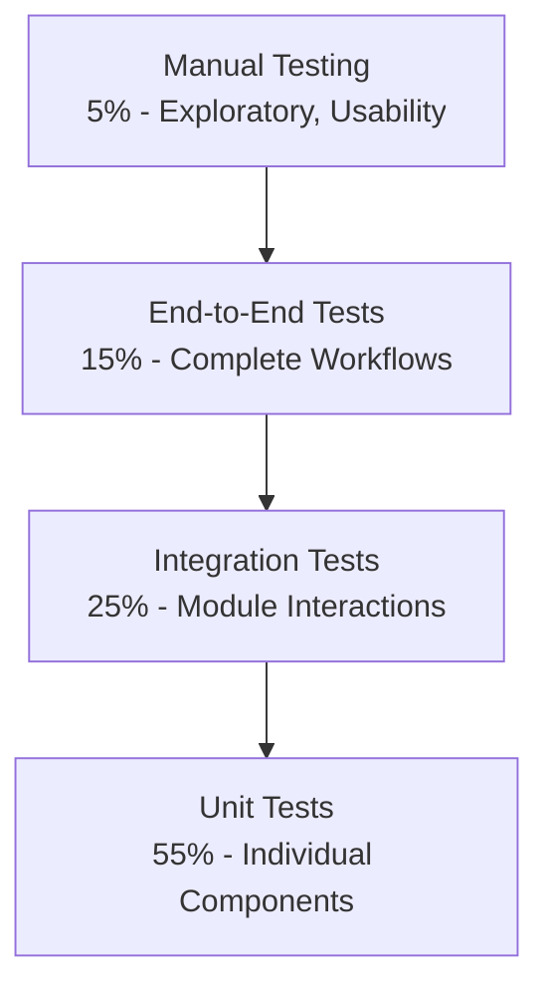

# Comprehensive Testing Strategy
## Modular Spiral Stair Creator System

### Overview

This document outlines a comprehensive testing strategy for the Modular Spiral Stair Creator System, addressing the critical gap identified in the original documentation. The strategy ensures ≥90% code coverage, robust error handling validation, and comprehensive integration testing.

---

## Testing Philosophy and Approach

### Testing Pyramid Strategy



### Test-Driven Development (TDD) Integration

**Implementation Timeline:**
- **Week 1-2**: Core module unit tests (TDD)
- **Week 3-4**: Integration tests for module interactions
- **Week 5-6**: System tests for complete workflows
- **Week 7-8**: Performance, security, and acceptance testing

---

## Testing Framework Architecture

### Core Testing Infrastructure

```python
# test_framework.py
import pytest
import unittest.mock as mock
from typing import Any, Dict, List, Optional
from dataclasses import dataclass
import time
import psutil
import json

@dataclass
class TestResult:
    test_name: str
    status: str  # 'passed', 'failed', 'skipped'
    duration: float
    memory_usage: float
    error_message: Optional[str] = None
    coverage_data: Optional[Dict[str, float]] = None

class AutoCADMockInterface:
    """Mock AutoCAD interface for testing without actual AutoCAD"""
    
    def __init__(self):
        self.entities: Dict[str, Any] = {}
        self.call_log: List[str] = []
        self.failure_mode: Optional[str] = None
        
    def create_cylinder(self, center: List[float], radius: float, height: float) -> Optional[str]:
        """Mock cylinder creation"""
        if self.failure_mode == "cylinder_fail":
            return None
            
        handle = f"cylinder_{len(self.entities)}"
        self.entities[handle] = {
            "type": "cylinder",
            "center": center,
            "radius": radius,
            "height": height
        }
        self.call_log.append(f"create_cylinder({center}, {radius}, {height})")
        return handle
        
    def set_failure_mode(self, mode: str):
        """Set failure mode for testing error handling"""
        self.failure_mode = mode
        
    def get_call_log(self) -> List[str]:
        """Return log of all method calls"""
        return self.call_log.copy()

class TestMetricsCollector:
    """Collect testing metrics and performance data"""
    
    def __init__(self):
        self.test_results: List[TestResult] = []
        self.coverage_threshold = 0.90
        self.performance_thresholds = {
            "unit_test_max_time": 0.1,      # 100ms
            "integration_test_max_time": 5.0, # 5 seconds
            "memory_leak_threshold": 50.0   # 50MB growth
        }
    
    def record_test_result(self, result: TestResult):
        """Record test result with metrics"""
        self.test_results.append(result)
        
    def generate_test_report(self) -> Dict[str, Any]:
        """Generate comprehensive test report"""
        total_tests = len(self.test_results)
        passed_tests = sum(1 for r in self.test_results if r.status == 'passed')
        
        return {
            "summary": {
                "total_tests": total_tests,
                "passed": passed_tests,
                "failed": total_tests - passed_tests,
                "pass_rate": passed_tests / total_tests if total_tests > 0 else 0
            },
            "performance": {
                "avg_test_duration": sum(r.duration for r in self.test_results) / total_tests,
                "max_memory_usage": max(r.memory_usage for r in self.test_results),
                "slow_tests": [r for r in self.test_results if r.duration > 1.0]
            },
            "coverage": self._calculate_overall_coverage()
        }
```

---

## Unit Testing Strategy

### Module-Specific Test Suites

#### 1. Center Pole Module Tests

```python
# tests/test_center_pole_module.py
import pytest
import math
from unittest.mock import Mock, patch
from src.modules.center_pole_module import CenterPoleModule
from src.core.config_manager import StairConfiguration
from tests.test_framework import AutoCADMockInterface, TestMetricsCollector

class TestCenterPoleModule:
    """Comprehensive tests for CenterPoleModule"""
    
    def setup_method(self):
        """Setup test fixtures"""
        self.mock_autocad = AutoCADMockInterface()
        self.config = StairConfiguration({
            "basic_parameters": {
                "center_pole_diameter": 5.0,
                "overall_height": 120.0
            }
        })
        self.module = CenterPoleModule(self.config, self.mock_autocad)
        
    def test_validate_parameters_valid_config(self):
        """Test parameter validation with valid configuration"""
        is_valid, errors = self.module.validate_parameters()
        assert is_valid == True
        assert len(errors) == 0
        
    def test_validate_parameters_invalid_diameter(self):
        """Test parameter validation with invalid diameter"""
        self.config.basic_parameters["center_pole_diameter"] = 2.5  # Too small
        is_valid, errors = self.module.validate_parameters()
        assert is_valid == False
        assert "not available" in errors[0]
        
    def test_validate_parameters_invalid_height(self):
        """Test parameter validation with invalid height"""
        self.config.basic_parameters["overall_height"] = 300.0  # Too tall
        is_valid, errors = self.module.validate_parameters()
        assert is_valid == False
        assert "exceeds practical limit" in errors[0]
        
    def test_generate_geometry_success(self):
        """Test successful geometry generation"""
        success, messages, entities = self.module.generate_geometry()
        assert success == True
        assert len(messages) == 1
        assert "Center pole created" in messages[0]
        assert "pole_handle" in entities
        assert entities["diameter"] == 5.0
        assert entities["height"] == 120.0
        
    def test_generate_geometry_autocad_failure(self):
        """Test geometry generation with AutoCAD failure"""
        self.mock_autocad.set_failure_mode("cylinder_fail")
        success, messages, entities = self.module.generate_geometry()
        assert success == False
        assert "Failed to create center pole" in messages[0]
        assert entities == {}
        
    @pytest.mark.parametrize("diameter,expected_radius", [
        (3.0, 1.5),
        (5.0, 2.5),
        (8.625, 4.3125),
        (12.75, 6.375)
    ])
    def test_get_pole_radius(self, diameter, expected_radius):
        """Test pole radius calculation for various diameters"""
        self.config.basic_parameters["center_pole_diameter"] = diameter
        radius = self.module.get_pole_radius()
        assert abs(radius - expected_radius) < 0.001
        
    def test_cleanup_on_failure(self):
        """Test cleanup functionality after failure"""
        # Generate some entities first
        self.module.generate_geometry()
        initial_entity_count = len(self.module.generated_entities)
        assert initial_entity_count > 0
        
        # Cleanup
        self.module.cleanup_on_failure()
        assert len(self.module.generated_entities) == 0
        
    def test_required_parameters(self):
        """Test required parameters list"""
        required = self.module.get_required_parameters()
        expected = [
            "basic_parameters.center_pole_diameter", 
            "basic_parameters.overall_height"
        ]
        assert set(required) == set(expected)
        
    def test_performance_benchmark(self):
        """Test performance benchmarks"""
        start_time = time.time()
        success, messages, entities = self.module.generate_geometry()
        duration = time.time() - start_time
        
        assert success == True
        assert duration < 0.1  # Should complete in <100ms
```

#### 2. Tread Module Tests with Enhanced Functionality

```python
# tests/test_tread_module.py
import pytest
import math
from src.modules.tread_module import TreadModule, TreadGeometry
from tests.test_framework import AutoCADMockInterface

class TestTreadModule:
    """Comprehensive tests for TreadModule including add/remove functionality"""
    
    def setup_method(self):
        self.mock_autocad = AutoCADMockInterface()
        self.config = StairConfiguration({
            "basic_parameters": {
                "center_pole_diameter": 5.0,
                "overall_height": 120.0,
                "outside_diameter": 72.0,
                "total_rotation": 360.0,
                "is_clockwise": True
            },
            "tread_configuration": {
                "thickness": 0.25,
                "riser_height_max": 9.5
            }
        })
        self.module = TreadModule(self.config, self.mock_autocad)
        
    def test_calculate_num_treads_standard(self):
        """Test tread count calculation for standard configurations"""
        num_treads = self.module._calculate_num_treads(120.0)
        expected = math.ceil(120.0 / 9.5)  # 13 treads
        assert num_treads == expected
        
    def test_calculate_num_treads_with_midlanding(self):
        """Test tread calculation with midlanding requirement"""
        # Height > 151" requires midlanding
        self.config.basic_parameters["overall_height"] = 180.0
        geometries = self.module._calculate_tread_geometries()
        assert self.module.midlanding_index >= 0
        
        # Check that midlanding gets 90 degrees
        midlanding = geometries[self.module.midlanding_index]
        angle_span = abs(midlanding.end_angle - midlanding.start_angle)
        assert abs(angle_span - math.radians(90)) < 0.001
        
    def test_generate_geometry_success(self):
        """Test complete tread generation"""
        success, messages, entities = self.module.generate_geometry()
        assert success == True
        assert "num_treads" in entities
        assert entities["num_treads"] > 0
        assert "total_volume" in entities
        
    def test_add_tread_at_index(self):
        """Test adding tread at specific index"""
        # Generate initial treads
        self.module.generate_geometry()
        initial_count = len(self.module.tread_geometries)
        
        # Add tread at index 5
        success = self.module.add_tread_at_index(5)
        assert success == True
        assert len(self.module.tread_geometries) == initial_count + 1
        
    def test_remove_tread_at_index(self):
        """Test removing tread at specific index"""
        # Generate initial treads
        self.module.generate_geometry()
        initial_count = len(self.module.tread_geometries)
        
        # Remove tread at index 5
        success = self.module.remove_tread_at_index(5)
        assert success == True
        assert len(self.module.tread_geometries) == initial_count - 1
        
    def test_remove_tread_minimum_limit(self):
        """Test that removing treads respects minimum limit"""
        # Create configuration with only 2 treads
        self.config.basic_parameters["overall_height"] = 20.0
        self.module.generate_geometry()
        
        # Try to remove a tread - should fail
        success = self.module.remove_tread_at_index(0)
        assert success == False  # Can't go below minimum
        
    def test_edge_case_zero_rotation(self):
        """Test edge case with zero rotation"""
        self.config.basic_parameters["total_rotation"] = 0.0
        is_valid, errors = self.module.validate_parameters()
        assert is_valid == False
        assert "rotation must be between" in errors[0]
        
    def test_edge_case_excessive_rotation(self):
        """Test edge case with excessive rotation"""
        self.config.basic_parameters["total_rotation"] = 800.0
        is_valid, errors = self.module.validate_parameters()
        assert is_valid == False
        assert "rotation must be between" in errors[0]
```

#### 3. IBC Compliance Tests

```python
# tests/test_ibc_compliance.py
import pytest
from src.utils.ibc_compliance import IBCCompliance, ComplianceResult, ViolationType

class TestIBCCompliance:
    """Test IBC compliance validation"""
    
    def setup_method(self):
        self.compliance = IBCCompliance("IBC_2021")
        self.config = StairConfiguration({
            "basic_parameters": {
                "center_pole_diameter": 5.0,
                "overall_height": 120.0,
                "outside_diameter": 72.0,
                "total_rotation": 360.0
            },
            "handrail_configuration": {
                "enabled": True,
                "height_above_tread": 36.0
            },
            "picket_configuration": {
                "enabled": True,
                "spacing_inches": 3.5
            }
        })
        
    def test_walkline_width_compliance(self):
        """Test walkline width validation"""
        result = self.compliance.check_walkline_width(self.config)
        assert result.is_compliant == True
        assert "6.75" in result.message
        
    def test_walkline_width_violation(self):
        """Test walkline width violation detection"""
        # Create configuration that violates walkline width
        self.config.basic_parameters["total_rotation"] = 180.0  # Too tight
        result = self.compliance.check_walkline_width(self.config)
        assert result.is_compliant == False
        assert result.violation_type == ViolationType.ERROR
        assert "suggested_fix" in result.__dict__
        
    def test_handrail_height_compliance(self):
        """Test handrail height validation"""
        result = self.compliance.check_handrail_height(self.config)
        assert result.is_compliant == True
        
    def test_handrail_height_violation_low(self):
        """Test handrail height violation (too low)"""
        self.config.handrail_configuration["height_above_tread"] = 32.0
        result = self.compliance.check_handrail_height(self.config)
        assert result.is_compliant == False
        assert "34-38" in result.message
        
    def test_handrail_height_violation_high(self):
        """Test handrail height violation (too high)"""
        self.config.handrail_configuration["height_above_tread"] = 40.0
        result = self.compliance.check_handrail_height(self.config)
        assert result.is_compliant == False
        
    def test_picket_spacing_compliance(self):
        """Test picket spacing (4-inch sphere rule)"""
        result = self.compliance.check_picket_spacing(self.config)
        assert result.is_compliant == True
        
    def test_picket_spacing_violation(self):
        """Test picket spacing violation"""
        self.config.picket_configuration["spacing_inches"] = 5.0
        result = self.compliance.check_picket_spacing(self.config)
        assert result.is_compliant == False
        assert "4-inch sphere rule" in result.message
        
    def test_midlanding_requirement(self):
        """Test midlanding requirement for tall stairs"""
        self.config.basic_parameters["overall_height"] = 180.0  # Exceeds 151"
        results = self.compliance.check_all_requirements(self.config)
        
        midlanding_violations = [r for r in results if "midlanding" in r.message.lower()]
        assert len(midlanding_violations) > 0
        
    def test_comprehensive_compliance_check(self):
        """Test comprehensive compliance checking"""
        results = self.compliance.check_all_requirements(self.config)
        assert len(results) > 0  # Should have at least basic checks
        
        # No violations for default config
        violations = [r for r in results if not r.is_compliant]
        assert len(violations) == 0
```

---

## Integration Testing Strategy

### Module Integration Tests

```python
# tests/integration/test_module_orchestration.py
import pytest
from src.core.orchestrator import Orchestrator
from src.modules.center_pole_module import CenterPoleModule
from src.modules.tread_module import TreadModule
from src.modules.picket_module import PicketModule
from tests.test_framework import AutoCADMockInterface

class TestModuleOrchestration:
    """Test integration between modules"""
    
    def setup_method(self):
        self.mock_autocad = AutoCADMockInterface()
        self.orchestrator = Orchestrator(self.mock_autocad)
        self.config = self._create_full_config()
        
        # Register modules
        self.orchestrator.register_module("center_pole", CenterPoleModule)
        self.orchestrator.register_module("treads", TreadModule)
        self.orchestrator.register_module("pickets", PicketModule)
        
    def _create_full_config(self):
        """Create complete configuration for integration testing"""
        return StairConfiguration({
            "basic_parameters": {
                "center_pole_diameter": 5.0,
                "overall_height": 120.0,
                "outside_diameter": 72.0,
                "total_rotation": 360.0,
                "is_clockwise": True
            },
            "picket_configuration": {
                "enabled": True,
                "spacing_inches": 3.5,
                "height_ratio": 0.85,
                "style": "vertical"
            },
            "handrail_configuration": {
                "enabled": True,
                "height_above_tread": 36.0
            }
        })
        
    def test_sequential_module_execution(self):
        """Test modules execute in correct order"""
        results = self.orchestrator.execute_stair_generation(self.config)
        
        # All modules should complete successfully
        assert "center_pole" in results
        assert "treads" in results
        assert "pickets" in results
        
        for module_name, result in results.items():
            assert result.success == True
            
    def test_module_dependency_resolution(self):
        """Test that dependent modules receive required data"""
        results = self.orchestrator.execute_stair_generation(self.config)
        
        # Picket module should have received tread geometry data
        picket_result = results["pickets"]
        assert "total_pickets" in picket_result.entities
        assert picket_result.entities["total_pickets"] > 0
        
    def test_module_failure_isolation(self):
        """Test that module failures don't cascade"""
        # Force picket module to fail
        self.mock_autocad.set_failure_mode("cylinder_fail")
        
        results = self.orchestrator.execute_stair_generation(self.config)
        
        # Center pole and treads should still succeed
        assert results["center_pole"].success == True
        assert results["treads"].success == True
        
        # Pickets should fail but not crash the system
        assert results["pickets"].success == False
        
    def test_progress_reporting(self):
        """Test progress reporting during execution"""
        progress_updates = []
        
        def progress_callback(percentage, message):
            progress_updates.append((percentage, message))
            
        self.orchestrator.progress_callback = progress_callback
        results = self.orchestrator.execute_stair_generation(self.config)
        
        # Should have received progress updates
        assert len(progress_updates) > 0
        assert any("center_pole" in msg for _, msg in progress_updates)
        
    def test_configuration_validation_before_execution(self):
        """Test that invalid configurations are rejected before execution"""
        # Create invalid configuration
        invalid_config = self.config.copy()
        invalid_config.basic_parameters["center_pole_diameter"] = -1.0
        
        results = self.orchestrator.execute_stair_generation(invalid_config)
        
        # Should have validation errors
        validation_errors = [r for r in results.values() if not r.success]
        assert len(validation_errors) > 0
```

### AutoCAD Interface Integration Tests

```python
# tests/integration/test_autocad_interface.py
import pytest
from unittest.mock import Mock, patch
from src.core.autocad_interface import AutoCADInterface
import win32com.client

class TestAutoCADIntegration:
    """Test AutoCAD COM interface integration"""
    
    def setup_method(self):
        # Use actual AutoCAD interface in CI/CD environment
        # Fall back to mock in development
        try:
            self.autocad = AutoCADInterface()
            self.has_autocad = self.autocad.connect()
        except:
            self.autocad = AutoCADMockInterface()
            self.has_autocad = False
            
    @pytest.mark.skipif("not has_autocad", reason="AutoCAD not available")
    def test_autocad_connection(self):
        """Test connection to AutoCAD"""
        assert self.autocad.connect() == True
        assert self.autocad.app is not None
        assert self.autocad.doc is not None
        
    @pytest.mark.skipif("not has_autocad", reason="AutoCAD not available")
    def test_create_and_delete_entity(self):
        """Test entity creation and deletion cycle"""
        # Create cylinder
        handle = self.autocad.create_cylinder([0, 0, 0], 2.5, 10.0)
        assert handle is not None
        
        # Verify entity exists
        entity = self.autocad.get_entity_by_handle(handle)
        assert entity is not None
        
        # Delete entity
        success = self.autocad.delete_entity(handle)
        assert success == True
        
    def test_batch_operations(self):
        """Test batch operation performance"""
        self.autocad.batch_start()
        
        # Add multiple operations to batch
        for i in range(10):
            self.autocad.batch_operations.append(
                lambda: self.autocad.create_cylinder([i, 0, 0], 1.0, 5.0)
            )
            
        # Execute batch
        results = self.autocad.batch_execute()
        assert len(results) == 10
        
    def test_connection_retry_logic(self):
        """Test connection retry on failure"""
        with patch('win32com.client.GetActiveObject') as mock_get_object:
            # Simulate initial failure, then success
            mock_get_object.side_effect = [Exception("Connection failed"), Mock()]
            
            success = self.autocad.connect()
            assert success == True
            assert mock_get_object.call_count <= 3  # Within retry limit
```

---

## System Testing Strategy

### End-to-End Workflow Tests

```python
# tests/system/test_complete_workflows.py
import pytest
import json
import tempfile
import os
from src.ui.main_ui import MainUI
from src.core.config_manager import ConfigurationManager
from tests.test_framework import AutoCADMockInterface

class TestCompleteWorkflows:
    """Test complete user workflows end-to-end"""
    
    def setup_method(self):
        self.temp_dir = tempfile.mkdtemp()
        self.config_manager = ConfigurationManager("schemas/stair_config.json")
        self.mock_autocad = AutoCADMockInterface()
        
    def teardown_method(self):
        """Cleanup temporary files"""
        import shutil
        shutil.rmtree(self.temp_dir, ignore_errors=True)
        
    def test_complete_stair_generation_workflow(self):
        """Test complete workflow from UI to AutoCAD"""
        # 1. Create configuration
        config = {
            "metadata": {
                "config_version": "1.0.0",
                "project_name": "Test Stair"
            },
            "basic_parameters": {
                "center_pole_diameter": 5.0,
                "overall_height": 120.0,
                "outside_diameter": 72.0,
                "total_rotation": 360.0,
                "is_clockwise": True
            },
            "picket_configuration": {
                "enabled": True,
                "spacing_inches": 3.5
            },
            "handrail_configuration": {
                "enabled": True,
                "height_above_tread": 36.0
            }
        }
        
        # 2. Validate configuration
        is_valid, errors = self.config_manager.validate_configuration(config)
        assert is_valid == True
        
        # 3. Save configuration
        config_path = os.path.join(self.temp_dir, "test_stair.json")
        self.config_manager.save_configuration(config, config_path)
        
        # 4. Load configuration
        loaded_config = self.config_manager.load_configuration(config_path)
        assert loaded_config["basic_parameters"]["center_pole_diameter"] == 5.0
        
        # 5. Execute stair generation
        orchestrator = Orchestrator(self.mock_autocad)
        orchestrator.register_all_modules()
        
        results = orchestrator.execute_stair_generation(loaded_config)
        
        # 6. Verify results
        assert len(results) > 0
        successful_modules = [name for name, result in results.items() if result.success]
        assert len(successful_modules) > 0
        
    def test_configuration_migration_workflow(self):
        """Test configuration version migration"""
        # Create old version config
        old_config = {
            "metadata": {"config_version": "1.0.0"},
            "basic_parameters": {
                "center_pole_diameter": 5.0,
                "overall_height": 120.0
            }
        }
        
        # Migrate to new version
        migrated_config = self.config_manager.migrate_configuration(
            old_config, "1.1.0"
        )
        
        assert migrated_config["metadata"]["config_version"] == "1.1.0"
        
    def test_error_recovery_workflow(self):
        """Test error recovery and graceful failure handling"""
        # Create configuration that will cause errors
        invalid_config = {
            "metadata": {"config_version": "1.0.0"},
            "basic_parameters": {
                "center_pole_diameter": -1.0,  # Invalid
                "overall_height": 120.0,
                "outside_diameter": 20.0,  # Too small
                "total_rotation": 360.0,
                "is_clockwise": True
            }
        }
        
        # Attempt generation
        orchestrator = Orchestrator(self.mock_autocad)
        results = orchestrator.execute_stair_generation(invalid_config)
        
        # Should fail gracefully with clear error messages
        failed_modules = [name for name, result in results.items() if not result.success]
        assert len(failed_modules) > 0
        
        # Error messages should be informative
        for name, result in results.items():
            if not result.success:
                assert len(result.messages) > 0
                assert any("diameter" in msg.lower() for msg in result.messages)

    def test_performance_under_load(self):
        """Test system performance under load"""
        configs = []
        
        # Create multiple configurations
        for i in range(10):
            config = self._create_test_config(f"Stair_{i}")
            configs.append(config)
            
        start_time = time.time()
        
        # Process all configurations
        orchestrator = Orchestrator(self.mock_autocad)
        for config in configs:
            results = orchestrator.execute_stair_generation(config)
            
        duration = time.time() - start_time
        
        # Should complete within reasonable time
        assert duration < 30.0  # 30 seconds for 10 stairs
        
    def _create_test_config(self, name: str) -> Dict[str, Any]:
        """Helper to create test configuration"""
        return {
            "metadata": {
                "config_version": "1.0.0",
                "project_name": name
            },
            "basic_parameters": {
                "center_pole_diameter": 5.0,
                "overall_height": 120.0,
                "outside_diameter": 72.0,
                "total_rotation": 360.0,
                "is_clockwise": True
            }
        }
```

---

## Performance Testing Strategy

### Load Testing Framework

```python
# tests/performance/test_performance_benchmarks.py
import pytest
import time
import psutil
import threading
from concurrent.futures import ThreadPoolExecutor
from src.core.orchestrator import Orchestrator
from tests.test_framework import AutoCADMockInterface, TestMetricsCollector

class TestPerformanceBenchmarks:
    """Performance and load testing"""
    
    def setup_method(self):
        self.metrics = TestMetricsCollector()
        self.mock_autocad = AutoCADMockInterface()
        
    def test_single_stair_generation_performance(self):
        """Test performance of single stair generation"""
        config = self._create_standard_config()
        orchestrator = Orchestrator(self.mock_autocad)
        
        # Measure performance
        start_time = time.time()
        start_memory = psutil.Process().memory_info().rss / 1024 / 1024
        
        results = orchestrator.execute_stair_generation(config)
        
        end_time = time.time()
        end_memory = psutil.Process().memory_info().rss / 1024 / 1024
        
        duration = end_time - start_time
        memory_used = end_memory - start_memory
        
        # Performance assertions
        assert duration < 30.0  # Must complete within 30 seconds
        assert memory_used < 500.0  # Must use less than 500MB
        
        # Log metrics
        print(f"Generation time: {duration:.2f}s")
        print(f"Memory usage: {memory_used:.2f}MB")
        
    def test_complex_stair_performance(self):
        """Test performance with complex configurations"""
        config = self._create_complex_config()
        orchestrator = Orchestrator(self.mock_autocad)
        
        start_time = time.time()
        results = orchestrator.execute_stair_generation(config)
        duration = time.time() - start_time
        
        # Complex stairs should complete within 2 minutes
        assert duration < 120.0
        
    def test_concurrent_stair_generation(self):
        """Test concurrent generation of multiple stairs"""
        configs = [self._create_standard_config() for _ in range(5)]
        
        def generate_stair(config):
            orchestrator = Orchestrator(AutoCADMockInterface())
            return orchestrator.execute_stair_generation(config)
            
        start_time = time.time()
        
        with ThreadPoolExecutor(max_workers=3) as executor:
            futures = [executor.submit(generate_stair, config) for config in configs]
            results = [future.result() for future in futures]
            
        duration = time.time() - start_time
        
        # Concurrent generation should not be significantly slower
        assert duration < 60.0  # 5 stairs in parallel within 1 minute
        assert len(results) == 5
        
    def test_memory_leak_detection(self):
        """Test for memory leaks during repeated operations"""
        config = self._create_standard_config()
        orchestrator = Orchestrator(self.mock_autocad)
        
        initial_memory = psutil.Process().memory_info().rss / 1024 / 1024
        
        # Run multiple generations
        for i in range(10):
            results = orchestrator.execute_stair_generation(config)
            
        final_memory = psutil.Process().memory_info().rss / 1024 / 1024
        memory_growth = final_memory - initial_memory
        
        # Memory growth should be minimal
        assert memory_growth < 100.0  # Less than 100MB growth
        
    def test_autocad_com_call_optimization(self):
        """Test AutoCAD COM call optimization"""
        config = self._create_standard_config()
        orchestrator = Orchestrator(self.mock_autocad)
        
        # Enable COM call logging
        self.mock_autocad.call_log.clear()
        
        results = orchestrator.execute_stair_generation(config)
        
        # Analyze COM call patterns
        total_calls = len(self.mock_autocad.call_log)
        print(f"Total COM calls: {total_calls}")
        
        # Should be optimized to minimize calls
        assert total_calls < 1000  # Reasonable limit for standard stair
        
    def _create_standard_config(self):
        """Create standard test configuration"""
        return {
            "metadata": {"config_version": "1.0.0"},
            "basic_parameters": {
                "center_pole_diameter": 5.0,
                "overall_height": 120.0,
                "outside_diameter": 72.0,
                "total_rotation": 360.0,
                "is_clockwise": True
            }
        }
        
    def _create_complex_config(self):
        """Create complex test configuration"""
        return {
            "metadata": {"config_version": "1.0.0"},
            "basic_parameters": {
                "center_pole_diameter": 8.625,
                "overall_height": 200.0,  # Requires midlanding
                "outside_diameter": 120.0,
                "total_rotation": 540.0,  # 1.5 turns
                "is_clockwise": True
            },
            "picket_configuration": {
                "enabled": True,
                "spacing_inches": 3.0,
                "style": "crossed"
            },
            "handrail_configuration": {
                "enabled": True,
                "continuous": True
            },
            "post_configuration": {
                "enabled": True,
                "spacing_treads": 3
            }
        }
```

---

## Security Testing Strategy

### Input Validation and Security Tests

```python
# tests/security/test_security_validation.py
import pytest
import json
import tempfile
from src.core.config_manager import ConfigurationManager

class TestSecurityValidation:
    """Security testing for input validation and injection prevention"""
    
    def setup_method(self):
        self.config_manager = ConfigurationManager("schemas/stair_config.json")
        
    def test_json_injection_prevention(self):
        """Test prevention of JSON injection attacks"""
        malicious_configs = [
            # Code injection attempt
            {
                "metadata": {
                    "config_version": "1.0.0",
                    "project_name": "__import__('os').system('rm -rf /')"
                }
            },
            # Script injection
            {
                "basic_parameters": {
                    "center_pole_diameter": "<script>alert('xss')</script>"
                }
            },
            # Path traversal
            {
                "metadata": {
                    "config_version": "../../../etc/passwd"
                }
            }
        ]
        
        for malicious_config in malicious_configs:
            is_valid, errors = self.config_manager.validate_configuration(malicious_config)
            assert is_valid == False
            assert len(errors) > 0
            
    def test_file_size_limits(self):
        """Test file size limits for configuration files"""
        # Create oversized configuration
        oversized_config = {
            "metadata": {"config_version": "1.0.0"},
            "basic_parameters": {"center_pole_diameter": 5.0},
            "large_data": "x" * (11 * 1024 * 1024)  # 11MB
        }
        
        with tempfile.NamedTemporaryFile(mode='w', suffix='.json', delete=False) as f:
            json.dump(oversized_config, f)
            config_path = f.name
            
        # Should reject oversized file
        with pytest.raises(Exception) as exc_info:
            self.config_manager.load_configuration(config_path)
            
        assert "file size" in str(exc_info.value).lower()
        
    def test_parameter_bounds_validation(self):
        """Test strict bounds validation for numeric parameters"""
        invalid_configs = [
            # Extreme values
            {
                "metadata": {"config_version": "1.0.0"},
                "basic_parameters": {
                    "center_pole_diameter": float('inf'),
                    "overall_height": -1000.0
                }
            },
            # Buffer overflow attempts
            {
                "metadata": {"config_version": "1.0.0"},
                "basic_parameters": {
                    "center_pole_diameter": 1e308,  # Very large number
                    "overall_height": 120.0
                }
            }
        ]
        
        for invalid_config in invalid_configs:
            is_valid, errors = self.config_manager.validate_configuration(invalid_config)
            assert is_valid == False
            
    def test_unicode_handling(self):
        """Test proper Unicode handling and potential issues"""
        unicode_config = {
            "metadata": {
                "config_version": "1.0.0",
                "project_name": "楼梯项目",  # Chinese characters
                "description": "Escalier en spirale 🌀",  # French with emoji
                "created_by": "José María"  # Accented characters
            },
            "basic_parameters": {
                "center_pole_diameter": 5.0,
                "overall_height": 120.0,
                "outside_diameter": 72.0,
                "total_rotation": 360.0,
                "is_clockwise": True
            }
        }
        
        # Should handle Unicode properly
        is_valid, errors = self.config_manager.validate_configuration(unicode_config)
        assert is_valid == True
        
    def test_autocad_com_security(self):
        """Test AutoCAD COM interface security"""
        from src.core.autocad_interface import AutoCADInterface
        
        autocad = AutoCADInterface()
        
        # Test parameter sanitization
        malicious_inputs = [
            [float('inf'), 0, 0],  # Infinite coordinates
            ["'; DROP TABLE stairs; --", 0, 0],  # SQL-like injection
            [1e308, 1e308, 1e308]  # Extreme values
        ]
        
        for malicious_input in malicious_inputs:
            try:
                # Should handle malicious input gracefully
                result = autocad.create_cylinder(malicious_input, 5.0, 10.0)
                # If it doesn't throw an exception, it should return None (failure)
                assert result is None
            except (ValueError, TypeError, OverflowError):
                # Expected behavior - should reject invalid input
                pass
```

---

## Test Automation and CI/CD Integration

### Continuous Testing Pipeline

```yaml
# .github/workflows/testing.yml
name: Comprehensive Testing Pipeline

on:
  push:
    branches: [ main, develop ]
  pull_request:
    branches: [ main ]

jobs:
  unit-tests:
    runs-on: windows-latest
    
    steps:
    - uses: actions/checkout@v3
    
    - name: Set up Python
      uses: actions/setup-python@v3
      with:
        python-version: '3.10'
        
    - name: Install dependencies
      run: |
        pip install -r requirements-test.txt
        pip install pytest-cov pytest-xvfb pytest-mock
        
    - name: Run unit tests with coverage
      run: |
        pytest tests/unit/ --cov=src --cov-report=xml --cov-report=html --cov-fail-under=90
        
    - name: Upload coverage to Codecov
      uses: codecov/codecov-action@v3
      with:
        file: ./coverage.xml
        
  integration-tests:
    runs-on: windows-latest
    needs: unit-tests
    
    steps:
    - uses: actions/checkout@v3
    
    - name: Set up Python
      uses: actions/setup-python@v3
      with:
        python-version: '3.10'
        
    - name: Install dependencies
      run: |
        pip install -r requirements-test.txt
        
    - name: Run integration tests
      run: |
        pytest tests/integration/ --verbose --tb=short
        
  performance-tests:
    runs-on: windows-latest
    needs: integration-tests
    
    steps:
    - uses: actions/checkout@v3
    
    - name: Set up Python
      uses: actions/setup-python@v3
      with:
        python-version: '3.10'
        
    - name: Run performance benchmarks
      run: |
        pytest tests/performance/ --benchmark-only --benchmark-json=benchmark.json
        
    - name: Store benchmark results
      uses: benchmark-action/github-action-benchmark@v1
      with:
        tool: 'pytest'
        output-file-path: benchmark.json
        
  security-tests:
    runs-on: windows-latest
    
    steps:
    - uses: actions/checkout@v3
    
    - name: Run security scans
      run: |
        pip install bandit safety
        bandit -r src/
        safety check --json
        
    - name: Run security tests
      run: |
        pytest tests/security/ --verbose
```

### Test Reporting and Metrics

```python
# tests/conftest.py
import pytest
import json
import time
import psutil
from tests.test_framework import TestMetricsCollector

# Global metrics collector
metrics_collector = TestMetricsCollector()

def pytest_runtest_setup(item):
    """Setup for each test"""
    item.start_time = time.time()
    item.start_memory = psutil.Process().memory_info().rss / 1024 / 1024

def pytest_runtest_teardown(item, nextitem):
    """Teardown for each test"""
    if hasattr(item, 'start_time'):
        duration = time.time() - item.start_time
        memory_usage = psutil.Process().memory_info().rss / 1024 / 1024
        
        # Record test metrics
        result = TestResult(
            test_name=item.nodeid,
            status="passed" if item.passed else "failed",
            duration=duration,
            memory_usage=memory_usage
        )
        metrics_collector.record_test_result(result)

def pytest_sessionfinish(session, exitstatus):
    """Generate final test report"""
    report = metrics_collector.generate_test_report()
    
    with open('test_report.json', 'w') as f:
        json.dump(report, f, indent=2)
        
    print(f"\\nTest Summary:")
    print(f"Total tests: {report['summary']['total_tests']}")
    print(f"Pass rate: {report['summary']['pass_rate']:.1%}")
    print(f"Average duration: {report['performance']['avg_test_duration']:.3f}s")
    print(f"Max memory usage: {report['performance']['max_memory_usage']:.1f}MB")
```

---

## Testing Coverage Requirements

### Coverage Targets by Component

| Component Type | Minimum Coverage | Target Coverage |
|----------------|-----------------|----------------|
| Core Modules | 95% | 98% |
| UI Components | 85% | 90% |
| Configuration System | 98% | 99% |
| AutoCAD Interface | 90% | 95% |
| IBC Compliance | 100% | 100% |
| Error Handling | 95% | 98% |
| Utilities | 90% | 95% |

### Quality Gates

**Pre-commit Requirements:**
- All unit tests must pass
- Code coverage ≥ 90%
- No security vulnerabilities detected
- Performance benchmarks within thresholds

**Pull Request Requirements:**
- All test suites pass
- Integration tests complete successfully
- Code review approved
- Documentation updated

**Release Requirements:**
- Comprehensive test suite passes
- Performance tests meet benchmarks
- Security audit completed
- User acceptance testing completed

This comprehensive testing strategy ensures robust validation of all system components while maintaining the high quality standards necessary for a professional CAD integration tool.